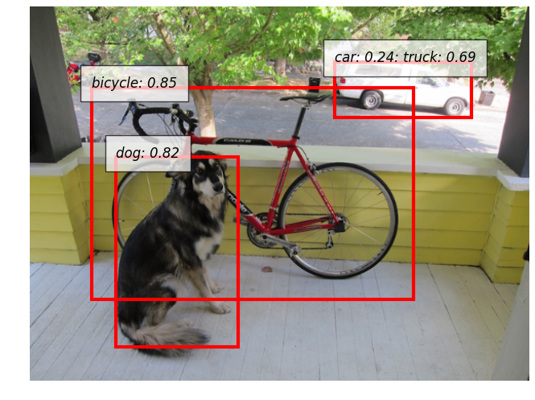

# Yolo_v2_chainer
Yolo v2 implementation by Chainer

YOLO9000: Better, Faster, Stronger [link](https://pjreddie.com/media/files/papers/YOLO9000.pdf)  
See the [project webpage](https://pjreddie.com/darknet/yolo/) for more details.

original code: https://github.com/pjreddie/darknet

  

## Download datasets
```bash
・COCO
http://cocodataset.org/#download

・VOC
http://host.robots.ox.ac.uk/pascal/VOC/voc2012/#devkit
```

## Converter from darknet to chainer
```bash
python to_chainer_converter.py --orig /path/to/original_model --name yolo_v2_chainer
```

## demo
```bash
python demo.py experiments/yolov2_update_608_test.yml --img_path ./data/dog.jpg --thresh 0.20 --nms_thresh 0.3 --save dog
nms: by class
nms_thresh = 0.3
img_thresh = ?
```

## Evaluation
```bash
# TODO
nms: by class
nms_thresh = 0.45
img_thresh = 0.005

74.88 by nms_class
mAP: 0.748830
aeroplane: 0.753767
bicycle: 0.820861
bird: 0.745648
boat: 0.622935
bottle: 0.489093
bus: 0.807101
car: 0.791615
cat: 0.864585
chair: 0.582848
cow: 0.806298
diningtable: 0.737123
dog: 0.856030
horse: 0.869149
motorbike: 0.834272
person: 0.758709
pottedplant: 0.512006
sheep: 0.768521
sofa: 0.737231
train: 0.870236
tvmonitor: 0.748571

72.68 by nms_obj
mAP: 0.726813
aeroplane: 0.729426
bicycle: 0.781958
bird: 0.738984
boat: 0.613187
bottle: 0.485178
bus: 0.774853
car: 0.790795
cat: 0.857089
chair: 0.563820
cow: 0.773109
diningtable: 0.716118
dog: 0.792385
horse: 0.807778
motorbike: 0.800471
person: 0.754253
pottedplant: 0.513937
sheep: 0.758658
sofa: 0.668391
train: 0.868849
tvmonitor: 0.747030

nms_thresh = 0.5
img_thresh = 0.001

mAP: 0.752346
aeroplane: 0.764791
bicycle: 0.823374
bird: 0.746711
boat: 0.629053
bottle: 0.489706
bus: 0.808811
car: 0.802805
cat: 0.871045
chair: 0.583098
cow: 0.806180
diningtable: 0.740243
dog: 0.853975
horse: 0.864735
motorbike: 0.838583
person: 0.759784
pottedplant: 0.514885
sheep: 0.774116
sofa: 0.739624
train: 0.869273
tvmonitor: 0.766132

nms_thresh = 0.45
img_thresh = 0.001

mAP: 0.750208
aeroplane: 0.753767
bicycle: 0.820861
bird: 0.745648
boat: 0.622935
bottle: 0.491614
bus: 0.807101
car: 0.796717
cat: 0.869158
chair: 0.582854
cow: 0.806298
diningtable: 0.742720
dog: 0.856030
horse: 0.869149
motorbike: 0.834272
person: 0.758709
pottedplant: 0.512460
sheep: 0.768521
sofa: 0.737251
train: 0.870236
tvmonitor: 0.757863

nms_thresh = 0.5
img_thresh = 0.005

```

## Model Comparison from Darknet
| Model | Dataset | cfg | darknet weight | Chainer | orig fps | chainer fps |
|:--------------:|:---------------:|:---------------:|:---------------:|:---------------:|:---------------:|:---------------:|
| **YOLOv2** | **VOC2007+20012** | **[link](https://github.com/pjreddie/darknet/blob/master/cfg/yolo-voc.cfg)** | **[link](https://pjreddie.com/media/files/yolo-voc.weights)** | | **** | **** |
| **YOLOv2 544×544** | **VOC2007+20012** | **[link](https://github.com/pjreddie/darknet/blob/master/cfg/yolo-voc.cfg)** | **[link](https://pjreddie.com/media/files/yolo-voc.weights)** | | | |
| **Tiny YOLO** | **VOC2007+20012** | **[link](https://github.com/pjreddie/darknet/blob/master/cfg/tiny-yolo-voc.cfg)** | **[link](https://pjreddie.com/media/files/tiny-yolo-voc.weights)** | | | |
| **YOLOv2 608×608** | **COCO** | **[link](https://github.com/pjreddie/darknet/blob/master/cfg/yolo.cfg)** | **[link](https://pjreddie.com/media/files/yolo.weights)** | **[link](https://www.dropbox.com/s/j9ehggm8f82h0kb/yolov2_update_coco_608.npz)** | 58.8 | 66.6 |
| **Tiny YOLO** | **COCO** | **[link](https://github.com/pjreddie/darknet/blob/master/cfg/tiny-yolo.cfg)** | **[link](https://pjreddie.com/media/files/tiny-yolo.weights)** | | | |
| **prior version(YOLOv2)** | **COCO** | **[link](https://github.com/pjreddie/darknet/blob/master/cfg/yolo.2.0.cfg)** | **[link](https://drive.google.com/open?id=0B4kMaWAXZNSWcUJCVW1aOHV0MkU)** | **[link](https://www.dropbox.com/s/vff05c4gb6dojft/yolov2_prior_coco_608.npz)**|  |  | |

<!-- ## Darknetを読んで
- GroundTruthは、一枚ごとに30個以内（インスタンス）と仮定している。
- loss関数の計算方法
- まず、各pixel, anchor毎に、GroundTruthとIOU Matchingを行う。 もしmax iouが閾値を超えている場合、
  その領域の誤差を0とする。もし閾値を超えていなければ、noobject_scale * (0 - l.output[index])
  また、少ないbatch数(12800まで)のときには、すべての領域に関して、x, y, w, hの誤差を計算する。scaleは0.01
- GroundTruthの(x, y, w, h)の値は、(x / img_w, y / img_h, exp(w * (anchor_w / img_w)))
- Anchorの値の意味： -->


# TODO
- Data loader for imagenet and coco dataset.
- Training codes for darknet 224×224, 448×448.
- Training codes for Yolo v2.
- Evaluation scripts for Imagenet[2012] and COCO[2014] dataset.
- Inference scripts for Yolo v2.
- Model converter from darknet to Chainer.
